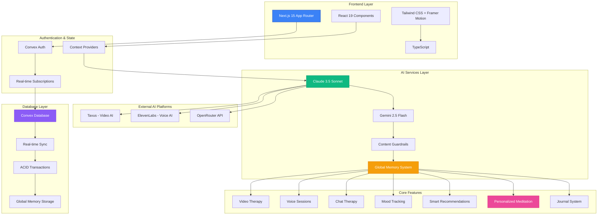
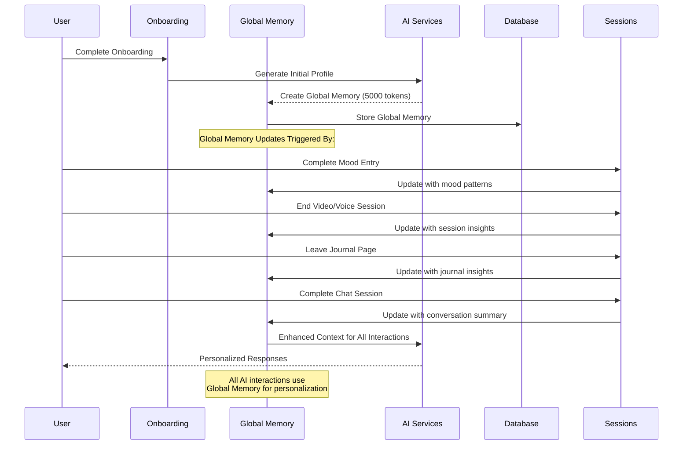
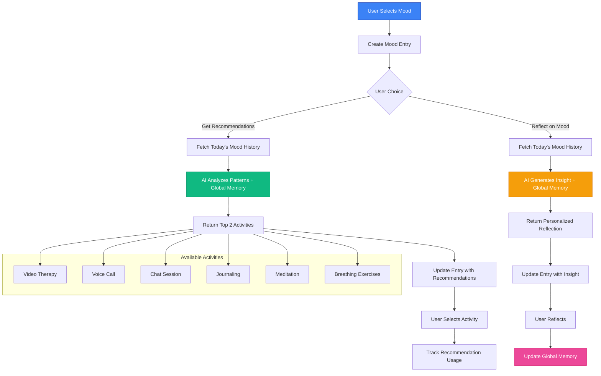
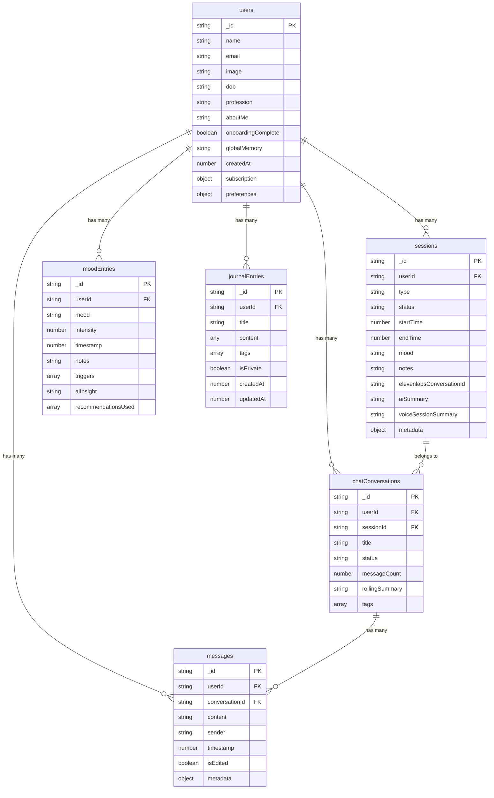

# 🧠 MindfulAI - Advanced AI-Powered Mental Health Platform

<div align="center">


[](https://nextjs.org/)
[](https://www.typescriptlang.org/)
[](https://convex.dev/)
[](https://tailwindcss.com/)
[](https://www.framer.com/motion/)

**A revolutionary mental health platform combining AI therapy, real-time video sessions, voice calls, intelligent mood tracking, and personalized meditation with advanced global memory management.**

[🚀 Live Demo](#) • [📖 Documentation](#features) • [🛠️ Installation](#installation) • [🤝 Contributing](#contributing)

</div>

---

## 🌟 Platform Overview

MindfulAI represents the next generation of digital mental health support, seamlessly integrating multiple AI-powered therapeutic modalities with sophisticated global memory management and personalized insights. Our platform provides 24/7 mental health support through various channels while maintaining therapeutic continuity and user privacy through an advanced global memory system that learns and adapts to each user's unique needs.

### 🎯 Core Mission

Democratize access to quality mental health support through cutting-edge AI technology, making therapeutic assistance available anytime, anywhere, while maintaining the highest standards of privacy and clinical effectiveness through personalized, context-aware interactions.

---

## 🏗️ System Architecture



---

## 🚀 Key Features

### 🎥 **Multi-Modal AI Therapy**

- **Video Therapy**: Real-time AI avatar sessions using Tavus technology
- **Voice Conversations**: Natural phone-based therapy via ElevenLabs
- **Text Chat**: Intelligent messaging with context-aware responses
- **Seamless Switching**: Move between modalities while maintaining context

### 🧠 **Advanced Global Memory System**

- **Comprehensive User Profiling**: 5000-token global memory for deep personalization
- **Onboarding Integration**: Captures user background, personality, and preferences
- **Cross-Session Continuity**: Maintains therapeutic relationship across all interactions
- **Intelligent Updates**: Automatically updates from mood entries, sessions, and journal entries
- **Context-Aware Responses**: All AI interactions leverage global memory for personalization

### 🧘‍♀️ **Personalized Meditation**

- **AI-Generated Scripts**: Custom meditation scripts based on global memory
- **Natural Voice Synthesis**: ElevenLabs TTS with natural pauses and soothing delivery
- **Multiple Focus Areas**: Stress relief, anxiety reduction, sleep, focus, emotional balance
- **Adaptive Duration**: 3-20 minute sessions based on user preference
- **Progress Tracking**: Session completion updates global memory for future personalization

### 📊 **Intelligent Mood Tracking**

- **Daily Check-ins**: Simple mood selection with intensity tracking
- **AI-Powered Insights**: Personalized reflections based on mood patterns
- **Smart Recommendations**: Activity suggestions tailored to current emotional state
- **Pattern Recognition**: Identify triggers and emotional trends
- **Global Memory Integration**: Mood patterns inform all future interactions

### 📝 **Advanced Journal System**

- **Rich Text Editor**: TipTap-powered editor with full formatting capabilities
- **Real-time Saving**: Auto-save functionality with conflict resolution
- **Search & Organization**: Full-text search and tagging system
- **Privacy Controls**: Secure, encrypted journal entries
- **Memory Integration**: Journal insights automatically update global memory

### 🔒 **Enterprise-Grade Security**

- **End-to-End Encryption**: All conversations and data protected
- **HIPAA Compliance**: Healthcare-grade privacy standards
- **Content Guardrails**: AI safety measures and topic boundaries
- **Secure Authentication**: Multi-provider auth with Convex Auth

---

## 🔄 Global Memory System Flow



---

## 🧘‍♀️ Meditation System Architecture

```mermaid
flowchart TD
    A[User Selects Preferences] --> B[Duration & Focus Area]
    B --> C[Optional Custom Request]
    C --> D[Fetch Global Memory]
    
    D --> E[AI Script Generation]
    E --> F[Gemini 2.5 Flash API]
    F --> G[Personalized Script with Pauses]
    
    G --> H[ElevenLabs TTS]
    H --> I[Natural Voice Synthesis]
    I --> J[Audio Player Interface]
    
    J --> K{Session Complete?}
    K -->|Yes| L[Update Global Memory]
    K -->|No| M[Continue Playing]
    
    L --> N[Store Session Data]
    M --> J

    subgraph "Meditation Features"
        O[Natural Pauses [...]]
        P[Soothing Voice Settings]
        Q[Progress Tracking]
        R[Volume Controls]
        S[Replay Options]
    end

    I --> O
    I --> P
    J --> Q
    J --> R
    J --> S

    style E fill:#10b981,stroke:#059669,color:#fff
    style H fill:#3b82f6,stroke:#1e40af,color:#fff
    style L fill:#f59e0b,stroke:#d97706,color:#fff
```

---

## 🎭 Mood Tracking & Recommendations System



---

## 🗄️ Database Schema



---

## 🛠️ Technology Stack

### **Frontend**

- **Framework**: Next.js 15 with App Router
- **Language**: TypeScript 5.8.3
- **Styling**: Tailwind CSS with custom therapeutic design system
- **Animations**: Framer Motion for smooth micro-interactions
- **UI Components**: Radix UI + shadcn/ui
- **Icons**: Lucide React
- **Rich Text**: TipTap editor with full formatting

### **Backend & Database**

- **Database**: Convex (Real-time, serverless)
- **Authentication**: Convex Auth with multi-provider support
- **Real-time**: Built-in subscriptions and live queries
- **Type Safety**: End-to-end TypeScript
- **Background Jobs**: Convex actions for delayed processing

### **AI & External Services**

- **Primary AI**: Claude 3.5 Sonnet via OpenRouter
- **Secondary AI**: Gemini 2.5 Flash for meditation scripts
- **Video AI**: Tavus for realistic avatar conversations
- **Voice AI**: ElevenLabs for natural phone conversations and meditation audio
- **Content Safety**: Custom guardrails and topic boundaries

### **Development & Deployment**

- **Package Manager**: npm
- **Linting**: ESLint with Next.js config
- **Styling**: PostCSS with Tailwind
- **Deployment**: Vercel (recommended)

---

## 📦 Installation

### Prerequisites

- Node.js 18.17.0 or higher
- npm or yarn package manager
- Convex account
- API keys for external services

### Quick Start

```bash
# Clone the repository
git clone https://github.com/your-username/mindful-ai.git
cd mindful-ai

# Install dependencies
npm install

# Set up environment variables
cp .env.example .env.local

# Configure Convex
npx convex dev

# Start development server
npm run dev
```

### Environment Configuration

Create a `.env.local` file with the following variables:

```env
# Convex Database
CONVEX_DEPLOYMENT=your-convex-deployment-url
NEXT_PUBLIC_CONVEX_URL=https://your-convex-deployment.convex.cloud

# AI Services
OPENROUTER_API_KEY=your-openrouter-api-key
GEMINI_API_KEY=your-gemini-api-key

# Tavus AI (Video Therapy)
TAVUS_API_KEY=your-tavus-api-key
TAVUS_REPLICA_ID=your-tavus-replica-id
TAVUS_PERSONA_ID=your-tavus-persona-id

# ElevenLabs (Voice AI & Meditation)
ELEVENLABS_API_KEY=your-elevenlabs-api-key
ELEVENLABS_VOICE_ID=your-elevenlabs-voice-id
ELEVENLABS_AGENT_ID=your-elevenlabs-agent-id
ELEVENLABS_AGENT_PHONE_NUMBER_ID=your-elevenlabs-agent-phone-number-id

# Authentication
AUTH_DOMAIN=localhost:3000
SITE_URL=http://localhost:3000
```

---

## 🎨 Design System

### **Therapeutic Design Principles**

- **Calming Colors**: Soft blues, greens, purples, and warm neutrals
- **Glassmorphism**: Subtle transparency and blur effects
- **Micro-interactions**: Gentle animations that provide feedback
- **Accessibility**: WCAG 2.1 AA compliant design
- **Responsive**: Mobile-first approach with fluid layouts

### **Custom CSS Classes**

```css
.glass-card          /* Glassmorphism card effect */
.therapeutic-hover   /* Gentle hover animations */
.floating-card       /* Elevated card with shadow */
.ripple-effect       /* Button press feedback */
.animate-gentle-pulse /* Subtle pulsing animation */
.backdrop-blur-therapeutic /* 15px blur for glass effects */
```

---

## 🧠 Global Memory System

### **Memory Structure**

The global memory system maintains a comprehensive 5000-token profile for each user, including:

- **Basic Information**: Demographics, profession, calculated age
- **Personality Profile**: Self-description, habits, behavioral patterns
- **Therapeutic History**: Session summaries, progress notes
- **Mood Patterns**: Emotional trends and triggers
- **Interaction Preferences**: Communication style, preferred modalities
- **Session Notes**: Key insights from therapy sessions
- **Journal Insights**: Themes and patterns from journal entries

### **Update Triggers**

Global memory is automatically updated when:

1. **Mood Entries**: After creating mood entries (with recent history context)
2. **Video Sessions**: When sessions end and transcript is available
3. **Voice Sessions**: After call completion with transcript summary
4. **Journal Activity**: When user leaves journal page with recent entries
5. **Chat Sessions**: After conversation summary updates

### **Personalization Impact**

Global memory enhances:

- **Therapy Sessions**: Contextual responses based on user history
- **Meditation Scripts**: Personalized content and focus areas
- **Mood Recommendations**: Activities tailored to user patterns
- **Communication Style**: AI adapts to user's preferred interaction style

---

## 🧘‍♀️ Meditation Feature

### **Personalization Engine**

- **Global Memory Integration**: Scripts generated using comprehensive user profile
- **Adaptive Content**: Meditation style adapts to user's personality and needs
- **Focus Areas**: 7 specialized meditation types (stress, anxiety, sleep, focus, etc.)
- **Duration Flexibility**: 3-20 minute sessions based on user preference

### **Audio Generation**

- **Natural Pauses**: Scripts include " [...] " for breathing spaces
- **ElevenLabs TTS**: High-quality voice synthesis optimized for meditation
- **Voice Settings**: Stability: 50%, Similarity: 75%, Speed: 0.9 for calming delivery
- **Real-time Generation**: Custom audio created for each session

### **User Experience**

- **Intuitive Interface**: Simple preference selection with beautiful animations
- **Full Audio Controls**: Play/pause, restart, volume, progress tracking
- **Session Management**: Replay, create new, or complete with memory update
- **Progress Integration**: Completed sessions update global memory for future personalization

---

## 🔐 Security & Privacy

### **Data Protection**

- All user data encrypted at rest and in transit
- HIPAA-compliant data handling procedures
- Regular security audits and penetration testing
- Minimal data collection principle
- Global memory stored securely with encryption

### **AI Safety**

- Content guardrails prevent off-topic discussions
- Therapeutic focus maintained through system prompts
- Crisis detection and emergency resource routing
- Regular model safety evaluations
- Global memory access controls

### **Privacy Features**

- Anonymous usage options
- Data export and deletion rights
- Transparent privacy policy
- User consent management
- Global memory user control

---

## 📊 Performance Metrics

### **Technical Performance**

- **Page Load Time**: < 2 seconds
- **First Contentful Paint**: < 1.5 seconds
- **Cumulative Layout Shift**: < 0.1
- **Time to Interactive**: < 3 seconds

### **AI Response Times**

- **Chat Messages**: < 3 seconds average
- **Mood Recommendations**: < 5 seconds
- **Global Memory Updates**: < 2 seconds background
- **Meditation Generation**: < 15 seconds (including audio)
- **Voice Call Initiation**: < 10 seconds

---

## 🚀 Deployment

### **Vercel Deployment** (Recommended)

```bash
# Install Vercel CLI
npm i -g vercel

# Deploy to Vercel
vercel

# Set environment variables in Vercel dashboard
# Deploy Convex functions
npx convex deploy
```

### **Docker Deployment**

```dockerfile
FROM node:18-alpine
WORKDIR /app
COPY package*.json ./
RUN npm ci --only=production
COPY . .
RUN npm run build
EXPOSE 3000
CMD ["npm", "start"]
```

---

## 🧪 Testing

### **Test Coverage**

- Unit tests for AI functions and global memory
- Integration tests for API routes
- E2E tests for critical user flows
- Performance testing for AI response times
- Global memory consistency tests

```bash
# Run tests
npm test

# Run E2E tests
npm run test:e2e

# Generate coverage report
npm run test:coverage
```

---

## 🤝 Contributing

We welcome contributions from the community! Please read our [Contributing Guidelines](CONTRIBUTING.md) before submitting pull requests.

### **Development Workflow**

1. Fork the repository
2. Create a feature branch
3. Make your changes
4. Add tests for new functionality
5. Submit a pull request

### **Code Standards**

- TypeScript strict mode
- ESLint configuration compliance
- Prettier code formatting
- Conventional commit messages

---

## 📈 Roadmap

### **Q1 2024**

- [ ] Group therapy sessions with global memory sharing
- [ ] Advanced analytics dashboard with memory insights
- [ ] Mobile app development
- [ ] Integration with wearable devices for biometric data

### **Q2 2024**

- [ ] Multi-language support with cultural adaptation
- [ ] Therapist collaboration tools with memory sharing
- [ ] Advanced crisis intervention with memory context
- [ ] API for third-party integrations

### **Q3 2024**

- [ ] VR therapy sessions with immersive environments
- [ ] AI-powered therapy plans based on global memory
- [ ] Insurance integration and billing
- [ ] Clinical trial partnerships

### **Q4 2024**

- [ ] Advanced meditation features (guided imagery, binaural beats)
- [ ] Peer support communities with privacy controls
- [ ] Professional therapist matching based on memory profiles
- [ ] Advanced analytics and reporting for healthcare providers

---

## 📄 License

This project is licensed under the MIT License - see the [LICENSE](LICENSE) file for details.

---

## 🙏 Acknowledgments

- **Anthropic** for Claude AI technology
- **Google** for Gemini AI capabilities
- **Tavus** for video AI capabilities
- **ElevenLabs** for voice AI and meditation audio technology
- **Convex** for real-time database infrastructure
- **Vercel** for deployment platform
- **Open source community** for amazing tools and libraries

---

## 📞 Support & Contact

- **Documentation**: [docs.mindfulai.com](#)
- **Support Email**: support@mindfulai.com
- **Discord Community**: [Join our Discord](#)
- **Twitter**: [@MindfulAI](#)

---

<div align="center">

**Built with ❤️ for mental health awareness and support**

*Featuring advanced AI personalization through global memory management*

[](https://github.com/your-username/mindful-ai)
[](https://twitter.com/MindfulAI)

</div>