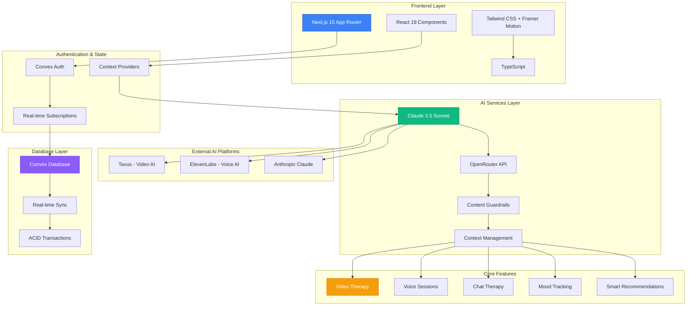
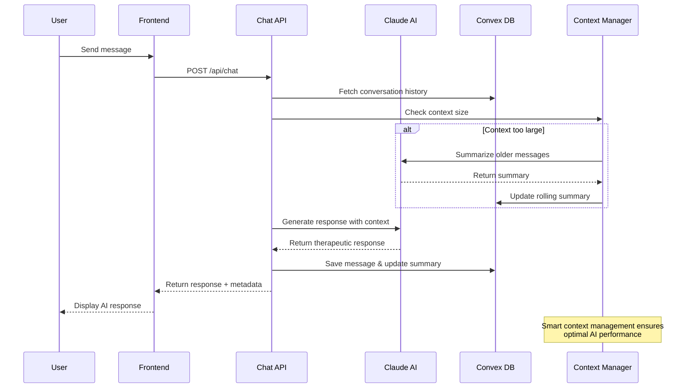
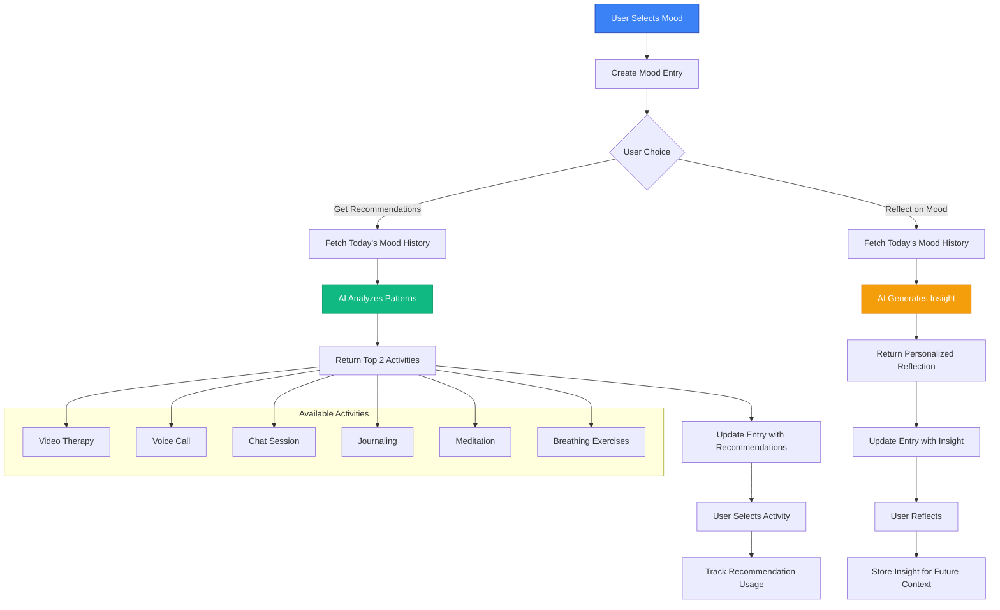
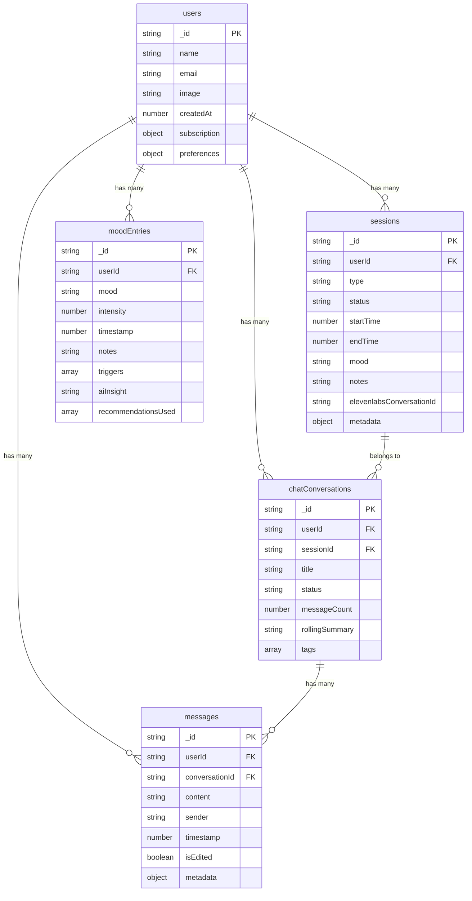

# 🧠 MindfulAI - Advanced AI-Powered Mental Health Platform

<div align="center">


[](https://nextjs.org/)
[](https://www.typescriptlang.org/)
[](https://convex.dev/)
[](https://tailwindcss.com/)
[](https://www.framer.com/motion/)

**A revolutionary mental health platform combining AI therapy, real-time video sessions, voice calls, and intelligent mood tracking with advanced context management.**

[🚀 Live Demo](#) • [📖 Documentation](#features) • [🛠️ Installation](#installation) • [🤝 Contributing](#contributing)

</div>

---

## 🌟 Platform Overview

MindfulAI represents the next generation of digital mental health support, seamlessly integrating multiple AI-powered therapeutic modalities with sophisticated context management and personalized insights. Our platform provides 24/7 mental health support through various channels while maintaining therapeutic continuity and user privacy.

### 🎯 Core Mission
Democratize access to quality mental health support through cutting-edge AI technology, making therapeutic assistance available anytime, anywhere, while maintaining the highest standards of privacy and clinical effectiveness.

---

## 🏗️ System Architecture



---

## 🚀 Key Features

### 🎥 **Multi-Modal AI Therapy**
- **Video Therapy**: Real-time AI avatar sessions using Tavus technology
- **Voice Conversations**: Natural phone-based therapy via ElevenLabs
- **Text Chat**: Intelligent messaging with context-aware responses
- **Seamless Switching**: Move between modalities while maintaining context

### 🧠 **Advanced Context Management**
- **Rolling Summaries**: Intelligent conversation summarization
- **Context Preservation**: Maintains therapeutic relationship across sessions
- **Smart Token Management**: Efficient context handling for optimal AI performance
- **Conversation Continuity**: Never lose therapeutic progress

### 📊 **Intelligent Mood Tracking**
- **Daily Check-ins**: Simple mood selection with intensity tracking
- **AI-Powered Insights**: Personalized reflections based on mood patterns
- **Smart Recommendations**: Activity suggestions tailored to current emotional state
- **Pattern Recognition**: Identify triggers and emotional trends

### 🔒 **Enterprise-Grade Security**
- **End-to-End Encryption**: All conversations and data protected
- **HIPAA Compliance**: Healthcare-grade privacy standards
- **Content Guardrails**: AI safety measures and topic boundaries
- **Secure Authentication**: Multi-provider auth with Convex Auth

---

## 🔄 AI Conversation Flow



---

## 🎭 Mood Tracking & Recommendations System



---

## 🗄️ Database Schema



---

## 🛠️ Technology Stack

### **Frontend**
- **Framework**: Next.js 15 with App Router
- **Language**: TypeScript 5.8.3
- **Styling**: Tailwind CSS with custom therapeutic design system
- **Animations**: Framer Motion for smooth micro-interactions
- **UI Components**: Radix UI + shadcn/ui
- **Icons**: Lucide React

### **Backend & Database**
- **Database**: Convex (Real-time, serverless)
- **Authentication**: Convex Auth with multi-provider support
- **Real-time**: Built-in subscriptions and live queries
- **Type Safety**: End-to-end TypeScript

### **AI & External Services**
- **Primary AI**: Claude 3.5 Sonnet via OpenRouter
- **Video AI**: Tavus for realistic avatar conversations
- **Voice AI**: ElevenLabs for natural phone conversations
- **Content Safety**: Custom guardrails and topic boundaries

### **Development & Deployment**
- **Package Manager**: npm
- **Linting**: ESLint with Next.js config
- **Styling**: PostCSS with Tailwind
- **Deployment**: Vercel (recommended)

---

## 📦 Installation

### Prerequisites
- Node.js 18.17.0 or higher
- npm or yarn package manager
- Convex account
- API keys for external services

### Quick Start

```bash
# Clone the repository
git clone https://github.com/your-username/mindful-ai.git
cd mindful-ai

# Install dependencies
npm install

# Set up environment variables
cp .env.example .env.local

# Configure Convex
npx convex dev

# Start development server
npm run dev
```

### Environment Configuration

Create a `.env.local` file with the following variables:

```env
# Convex Database
CONVEX_DEPLOYMENT=your-convex-deployment-url
NEXT_PUBLIC_CONVEX_URL=https://your-convex-deployment.convex.cloud

# AI Services
OPENROUTER_API_KEY=your-openrouter-api-key
ANTHROPIC_API_KEY=your-anthropic-api-key

# Tavus AI (Video Therapy)
TAVUS_API_KEY=your-tavus-api-key
TAVUS_REPLICA_ID=your-tavus-replica-id
TAVUS_PERSONA_ID=your-tavus-persona-id

# ElevenLabs (Voice AI)
ELEVENLABS_API_KEY=your-elevenlabs-api-key
ELEVENLABS_VOICE_ID=your-elevenlabs-voice-id
ELEVENLABS_AGENT_ID=your-elevenlabs-agent-id
ELEVENLABS_AGENT_PHONE_NUMBER_ID=your-elevenlabs-agent-phone-number-id

# Authentication
AUTH_DOMAIN=localhost:3000
SITE_URL=http://localhost:3000
```

---

## 🎨 Design System

### **Therapeutic Design Principles**
- **Calming Colors**: Soft blues, greens, and warm neutrals
- **Glassmorphism**: Subtle transparency and blur effects
- **Micro-interactions**: Gentle animations that provide feedback
- **Accessibility**: WCAG 2.1 AA compliant design
- **Responsive**: Mobile-first approach with fluid layouts

### **Custom CSS Classes**
```css
.glass-card          /* Glassmorphism card effect */
.therapeutic-hover   /* Gentle hover animations */
.floating-card       /* Elevated card with shadow */
.ripple-effect       /* Button press feedback */
.animate-gentle-pulse /* Subtle pulsing animation */
```

---

## 🔐 Security & Privacy

### **Data Protection**
- All user data encrypted at rest and in transit
- HIPAA-compliant data handling procedures
- Regular security audits and penetration testing
- Minimal data collection principle

### **AI Safety**
- Content guardrails prevent off-topic discussions
- Therapeutic focus maintained through system prompts
- Crisis detection and emergency resource routing
- Regular model safety evaluations

### **Privacy Features**
- Anonymous usage options
- Data export and deletion rights
- Transparent privacy policy
- User consent management

---

## 📊 Performance Metrics

### **Technical Performance**
- **Page Load Time**: < 2 seconds
- **First Contentful Paint**: < 1.5 seconds
- **Cumulative Layout Shift**: < 0.1
- **Time to Interactive**: < 3 seconds

### **AI Response Times**
- **Chat Messages**: < 3 seconds average
- **Mood Recommendations**: < 5 seconds
- **Context Summarization**: < 2 seconds
- **Voice Call Initiation**: < 10 seconds

---

## 🚀 Deployment

### **Vercel Deployment** (Recommended)

```bash
# Install Vercel CLI
npm i -g vercel

# Deploy to Vercel
vercel

# Set environment variables in Vercel dashboard
# Deploy Convex functions
npx convex deploy
```

### **Docker Deployment**

```dockerfile
FROM node:18-alpine
WORKDIR /app
COPY package*.json ./
RUN npm ci --only=production
COPY . .
RUN npm run build
EXPOSE 3000
CMD ["npm", "start"]
```

---

## 🧪 Testing

### **Test Coverage**
- Unit tests for AI functions
- Integration tests for API routes
- E2E tests for critical user flows
- Performance testing for AI response times

```bash
# Run tests
npm test

# Run E2E tests
npm run test:e2e

# Generate coverage report
npm run test:coverage
```

---

## 🤝 Contributing

We welcome contributions from the community! Please read our [Contributing Guidelines](CONTRIBUTING.md) before submitting pull requests.

### **Development Workflow**
1. Fork the repository
2. Create a feature branch
3. Make your changes
4. Add tests for new functionality
5. Submit a pull request

### **Code Standards**
- TypeScript strict mode
- ESLint configuration compliance
- Prettier code formatting
- Conventional commit messages

---

## 📈 Roadmap

### **Q1 2024**
- [ ] Group therapy sessions
- [ ] Advanced analytics dashboard
- [ ] Mobile app development
- [ ] Integration with wearable devices

### **Q2 2024**
- [ ] Multi-language support
- [ ] Therapist collaboration tools
- [ ] Advanced crisis intervention
- [ ] API for third-party integrations

### **Q3 2024**
- [ ] VR therapy sessions
- [ ] AI-powered therapy plans
- [ ] Insurance integration
- [ ] Clinical trial partnerships

---

## 📄 License

This project is licensed under the MIT License - see the [LICENSE](LICENSE) file for details.

---

## 🙏 Acknowledgments

- **Anthropic** for Claude AI technology
- **Tavus** for video AI capabilities
- **ElevenLabs** for voice AI technology
- **Convex** for real-time database infrastructure
- **Vercel** for deployment platform
- **Open source community** for amazing tools and libraries

---

## 📞 Support & Contact

- **Documentation**: [docs.mindfulai.com](#)
- **Support Email**: support@mindfulai.com
- **Discord Community**: [Join our Discord](#)
- **Twitter**: [@MindfulAI](#)

---

<div align="center">

**Built with ❤️ for mental health awareness and support**

[](https://github.com/your-username/mindful-ai)
[](https://twitter.com/MindfulAI)

</div>